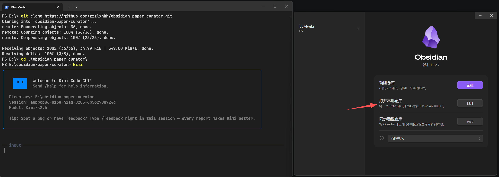
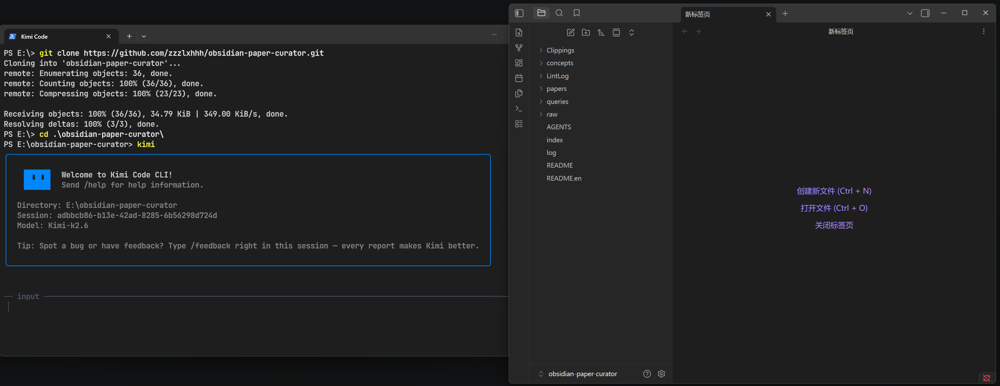
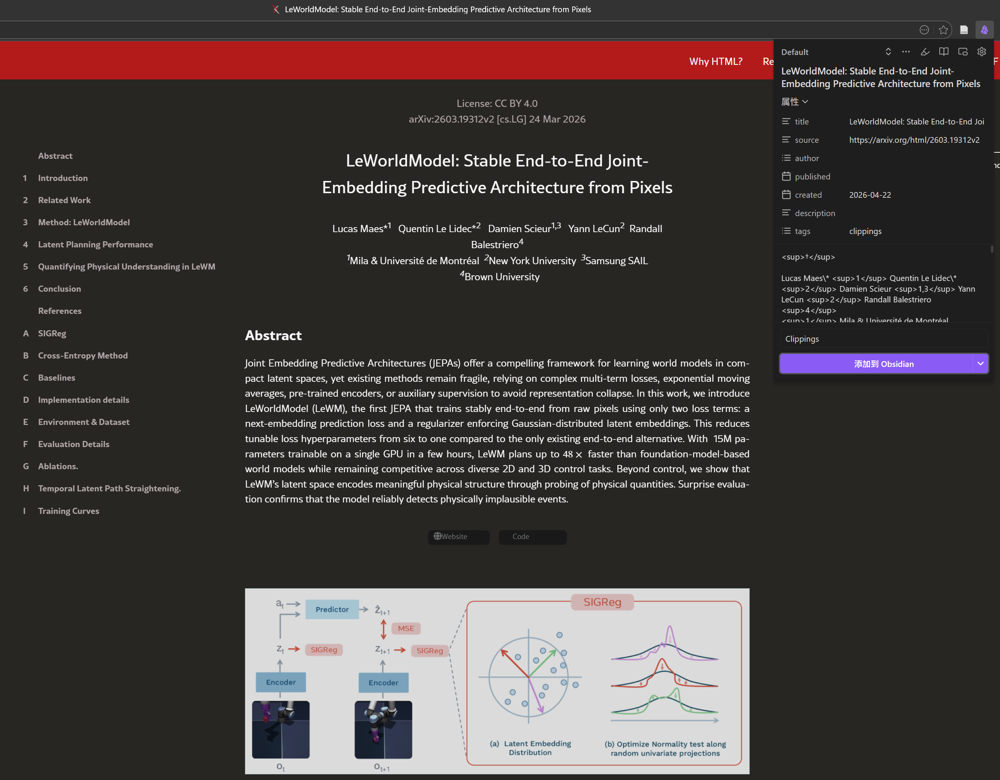
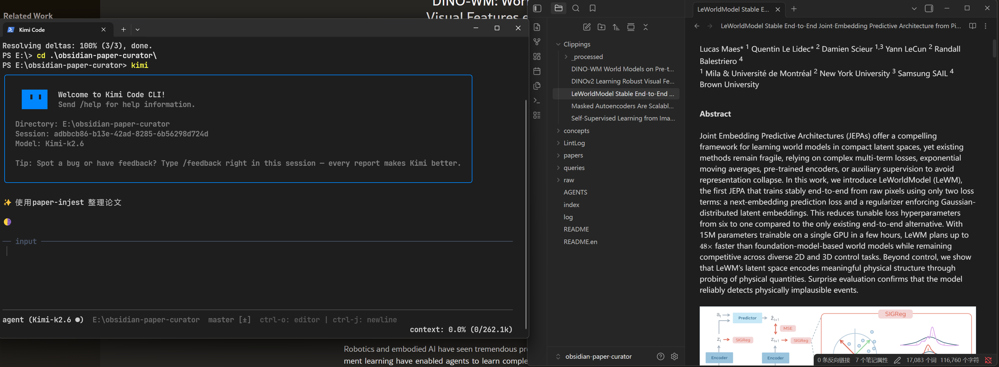
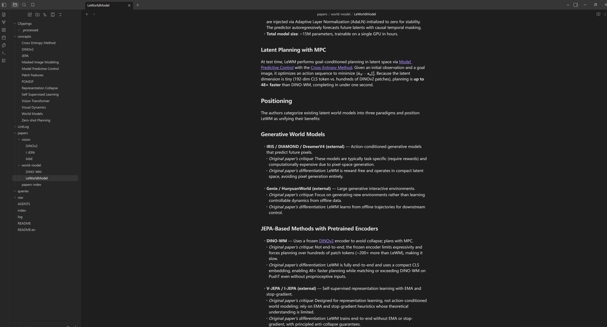

# obsidian-paper-curator — Paper Reading & Personal Knowledge Base

> A personal paper wiki powered by **Kimi CLI + Obsidian**. Let the LLM do the tedious work of organizing and linking — you just read and think deeply.

---

## What This Project Does

When reading papers, do you ever feel this way?

- You bookmark tons of papers to read later, then never open them again.
- You take notes in Obsidian, but never organize them. The graph view is a mess.
- You want bidirectional links and concept connections, but the maintenance drains all your energy.
- Your so-called "personal knowledge base" becomes a **performative art piece** — the graph looks cool, but your desire to actually use it keeps dropping.

Tools like Obsidian easily spiral into chaos without disciplined maintenance. Reading and thinking are effortless; **curation** is painful and draining. Tedious cross-referencing, contradiction detection, and concept classification — just hand them to the LLM. The collected papers might just gather dust and burn tokens at worst, but at least they won't pile into an unmaintainable mess that drains your energy every time you look at it.

**obsidian-paper-curator** is an **LLM Wiki** built on **Kimi CLI + Obsidian**. The design is partly inspired by Karpathy's [LLM wiki](https://gist.github.com/karpathy/442a6bf555914893e9891c11519de94f) methodology, adapted to personal usage habits:

- Most papers now offer HTML versions (more LLM-friendly than PDF), and arXiv provides an HTML view option. You can clip papers (or technical blog posts) with a single click using the Obsidian Web Clipper;
- Feed them to Kimi CLI, which uses three agent skills — **paper-injest**, **paper-query**, and **paper-lint** — to automatically read, summarize, extract concepts, build cross-references, and manage the wiki repository;
- You simply browse the finished product in Obsidian, ask questions, and perform the most critical step — deep thinking and actually absorbing the knowledge into your brain;
- **paper-injest**: Summarizes papers along Background, Challenges, Solution, Positioning, and Experiments. Its standout feature is automatically extracting key concepts as reusable knowledge nodes for cross-referencing across papers, which greatly accelerates understanding of a new domain's background. Moreover, the heart of research lies in comparing related work and tracing technological evolution — a paper's value is defined by how it positions itself. This is the part we care about most, and where we most want the LLM to do the initial legwork. Hence paper-injest includes strict constraints to ensure the LLM produces solid positioning analysis; in practice, Kimi k2.6 handles this remarkably well;
- **paper-query**: To avoid wasting tokens on meaningless retrieval, it implements a layered search architecture that adapts depth and granularity to the question type and difficulty. Q&A content is saved to `./queries` for future reference, managed autonomously by the user; content in `queries/` is never recorded in `index.md` or `log.md`, and subsequent retrievals never reference past Q&A in `queries/`. It never creates new concept or wiki pages from query outputs, avoiding context contamination and model hallucination.
- **paper-lint**: As Karpathy suggests, occasionally tidying the wiki repository to avoid single-link chains, orphan pages, and broken links. 

---

## The Three Skills: Core of the System

The entire workflow is driven by three Agent Skills. They are not independent tools — they form a closed loop:

```
        New Paper / Article
                ↓
    ┌───────────────┐
    │  paper-injest │  Ingest: read clipping → structured note → update concepts
    └───────┬───────┘
            ↓
    ┌───────────────┐
    │  paper-query  │  Query: answer complex questions from the curated wiki
    └───────┬───────┘
            ↓
    ┌───────────────┐
    │  paper-lint   │  Maintain: check link health, fix structural issues
    └───────┬───────┘
            ↓
        Back to injest
```

### paper-injest: Automated Ingestion & Structuring

**What you do**: Drop the `.md` files clipped by Obsidian Web Clipper into the `Clippings/` folder.

**What the LLM does**:
- **Duplicate Prevention**: Reads the ingest history in `log.md`, compares against the `Clippings/` directory, and only processes genuinely new files. Archives processed clippings to `Clippings/_processed/`.
- **Full-Text Reading Constraint**: Must read the entire paper before analysis begins. No skipping sections, no hallucination.
- **Knowledge Unit Decomposition**: Breaks the paper into Background / Challenges / Solution / Positioning / Key Concepts / Experiments, routed to the appropriate output targets.
- **Positioning Discipline** (core feature): Instead of letting the LLM invent its own critique, it **faithfully captures the paper's own Related Work section**.
  - Must contain two parts: a detailed list grouped by the paper's original categories + a high-level Summary Table.
  - For each related work entry, records three things: objective description, limitation identified by this paper, and how this paper claims to address it.
- **Automatic Topic Classification**: Assigns multi-label tags from 10 canonical topics (e.g., `video-generation`, `inference-optimization`). The primary topic determines the file path `papers/<topic>/`.
- **Concept Page Decision Rules**: General background knowledge (e.g., KV Cache) → create/update shared `concepts/` pages; paper-specific proper nouns (e.g., a custom module name) → described only within the paper page.
- **Auto-Backfill**: After creating a new paper page, scans the entire wiki for `(external)` references to this paper and upgrades them to internal links `[[...]]`.
- **Dataview Index Maintenance**: Maintains `papers/papers-index.md` with an auto-updating sortable table by author, year, venue, and topics.
- **Linking Discipline**: Every background concept on first mention must be a wikilink `[[...]]`; never duplicate content that already lives on a concept page.

**Core value**: A single ingest can trigger creation or updates across 10–15 wiki pages. You never manually create concept pages, links, or indexes.

---

### paper-query: Layered Retrieval & Intelligent Querying

**What you do**: Ask anything about ingested papers or concepts, from simple questions like "What RLHF papers do we have?" to complex ones like "What are the core differences between GRPO and PPO?"

**What the LLM does**:
- **Four-Layer Retrieval Architecture** (core feature), progressively deepening only when necessary:
  - **L1 Semantic Overview**: Reads `index.md` + Grep keywords + scans directories to build a knowledge map. Answers navigation-style questions immediately.
  - **L2 Structured Knowledge**: Reads candidate `papers/` and `concepts/` pages in full, with transitive expansion (follows relevant wikilinks). Answers concept definitions and paper summaries.
  - **L3 Raw Evidence**: Dives into `Clippings/` original sources for exact numbers, direct quotes, and table results. Only activated when summary pages lack granularity.
  - **L4 External Augmentation**: When wiki coverage is insufficient, supplements with LLM parametric knowledge or Web search; web sources must be labeled `[External: <URL>]`.
- **Citation Discipline**: Every factual claim must be traceable to a source via `[[Page Name]]`; contradictions must be surfaced explicitly.
- **Query Record Persistence**: Every query is automatically archived to `queries/<topic>/<YYYY-MM-DD>-<Short Title>.md`.
  - The H1 heading is a **refined restatement** of the user's question, not a verbatim copy.
  - Records which layers were used, all sources consulted, and the full synthesized answer.
- **Query Isolation**: Query results are saved as read-only archives in `queries/` only. No new wiki pages or concept files are created from query outputs, preventing unverified synthesis from polluting the knowledge base.

**Core value**: Querying isn't a one-off chat. Every query produces a traceable read-only archive, but answers are strictly grounded in ingested papers and concepts — LLM analyses are never fed back into the wiki graph.

---

### paper-lint: Structural Health Check & Auto-Repair

**What you do**: Say "lint the wiki".

**What the LLM does**:
- **Python Script Scan**: Runs `lint_scan.py` to generate a full link graph JSON, counting orphan pages, broken links, and high-frequency missing concepts.
- **Orphan Page Repair**: Not blindly forcing backlinks, but categorically — paper pages get added to `index.md` and backlinked from related concept pages; concept pages get added to `index.md` and cross-linked with related concepts; empty drafts/duplicates are flagged for human review instead.
- **Broken Link Repair**: Target exists under different name → correct wikilink; missing concept → create target page; paper not yet ingested → downgrade to `Title (external)`; unknown target → remove and record.
- **High-Frequency Missing Concept Creation**: Only creates `concepts/<Term>.md` for terms linked ≥3 times that are clearly reusable background knowledge; `count == 2` only if obviously general.
- **Missing Cross-Reference Backfill**: Scans paper pages for plain-text mentions of existing concepts and converts them to `[[Concept]]`; never creates speculative links to non-existent pages.
- **Full Diff Reports**: Every modification generates a timestamped report at `LintLog/YYYY-MM-DD-HHMMSS-lint-report.md` with reasons, context, and `+/-` diffs.
- **Idempotency Guarantee**: Running lint twice on an unchanged wiki should find zero new issues.

**Core value**: The larger the wiki, the more likely it is to fall apart. Lint ensures that every page is reachable via links, every concept has a home, and every link is valid — keeping the graph healthy.

---

## Full Workflow

```
Paper / Technical Article (HTML / PDF)
    ↓
Obsidian Web Clipper → Clippings/
    ↓
paper-injest: auto-generates structured notes + concept pages + cross-references + Dataview index
    ↓
Browse the graph in Obsidian, ask follow-up questions
    ↓
paper-query: answers complex questions from the wiki, auto-archives to queries/ (never writes back to wiki/index/log)
    ↓
(Periodically) paper-lint: scans link health, auto-fixes structural issues, outputs LintLog report
    ↓
Back to injest, loop forever
```

Sources aren't limited to papers — any high-quality technical content works: arXiv HTML, blog posts, documentation pages, or even a great Zhihu answer.

---

## Quick Directory Overview

```
obsidian-paper-curator/
├── .agents/skills/         # Agent skill definitions
│   ├── paper-injest/       # Paper ingestion skill
│   │   └── references/
│   │       └── paper-template.md
│   ├── paper-query/        # Intelligent querying skill
│   └── paper-lint/         # Structural maintenance skill
│       └── scripts/
│           └── lint_scan.py
├── Clippings/              # Inbox for web clippings (pending processing)
│   └── _processed/         # Archive of processed clippings (read-only)
├── concepts/               # Cross-paper concept pages (e.g., KV Cache, PPO)
├── papers/                 # Topic-organized paper notes
│   ├── papers-index.md     # Dataview metadata table
│   ├── LLM Inference/
│   └── Reinforcement Learning/
├── queries/                # Query archives (organized by topic, read-only after creation)
│   ├── reinforcement-learning/
│   └── ...
├── LintLog/                # Lint report archive
├── raw/                    # Original PDFs / images (read-only, immutable)
├── index.md                # Vault-wide index and catalog
├── log.md                  # Audit log (chronological, append-only)
└── AGENTS.md               # Agent conventions and workflows
```

---

## Core Principles

- **Humans read the wiki; the LLM writes it.** All summaries, links, and organization are done by the LLM.
- **raw/ is sacred.** Original sources are read-only and never modified or deleted.
- **One ingest, many updates.** A single paper may trigger creation or updates across 10–15 wiki pages.
- **Query results are isolated.** Q&A pairs are archived to `queries/` for user reference; no new wiki pages or concepts are created from them, avoiding knowledge base contamination.
- **Structure health is automated.** Lint runs periodically so the wiki doesn't decay over time.
- **Queries are archived.** Every question and its answer is automatically saved to `queries/`, forming a traceable Q&A knowledge base.

---

## Usage Walkthrough

**Prerequisites**: Install [Kimi Code CLI](https://github.com/moonshot-ai/kimi-cli) and [Obsidian](https://obsidian.md/). We also recommend installing the **Dataview** plugin in Obsidian.

### 1. Clone and Launch

Run in your terminal:

```bash
git clone https://github.com/zzzlxhhh/obsidian-paper-curator.git
cd obsidian-paper-curator
kimi
```

Open the project folder in Obsidian to see the full wiki structure:




### 2. Clip Papers

Use the **Obsidian Web Clipper** to clip paper web pages (we recommend arXiv HTML versions, which are more LLM-friendly than PDFs) into the `Clippings/` folder with one click.



### 3. Auto-Organize

Taking World Model papers as an example, invoke the `paper-injest` skill in Kimi to let it automatically read, summarize, extract concepts, and build links:



Kimi generates complete notes covering Background, Challenges, Solution, Positioning, and Experiments. The **Positioning** section is a particular highlight — Kimi k2.6 compares related work in detailed lists and attaches a Summary Table:



### 4. Ask the Wiki

Once the knowledge base is organized, you can query it directly. Invoke the `paper-query` skill in Kimi to ask your question; the Q&A record is automatically archived to `./queries/` for future reference:


