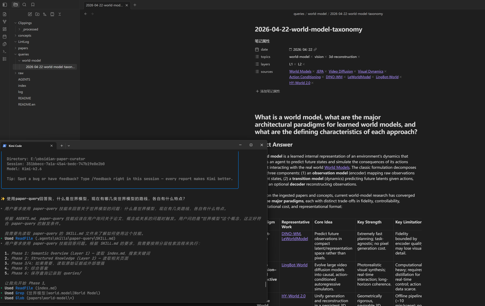

# obsidian-paper-curator — 论文阅读与个人知识库

> 用 Kimi CLI + Obsidian 做的个人的论文 wiki。让 LLM 替你做那些「整理和建链接」的脏活累活，你只需要负责阅读和深度思考。

---

## 这个项目是干什么的

读论文的时候，你有没有这种感觉：

- 收藏了很多待读论文，再也不会打开。
- 用 Obsidian 做笔记，记了一大堆，但从不整理，图谱视图一片混乱。
- 想建立双向链接、概念关联，非常消耗心力。
- 所谓的「个人知识库」最终沦为一种**看起来很美就够**，使用欲望逐渐降低。

Obsidian 这类笔记工具很容易在散漫的管理状态中越来越混乱，阅读和思考反而是简单且随时可以进行的，**整理**笔记却是痛苦且消耗的。枯燥的交叉引用、矛盾检测、概念归类，干脆交给LLM吧。有了obsidian-paper-curator，这些收集的论文顶多就是吃灰和消耗token，大不了就是收集了但是从来不看不学，起码不会堆成屎山消耗使用者的心力，让人眼见心烦。

**obsidian-paper-curator** 是一个基于 **Kimi CLI + Obsidian** 的 LLM Wiki，功能部分启发自 Karpathy 文章 [LLM wiki](https://gist.github.com/karpathy/442a6bf555914893e9891c11519de94f) 中的方法论，结合个人使用习惯做了如下设计：

- 现在大部分论文都会有html版本（比 PDF 更 LLM friendly），arxiv上都会有查看html的选项，我们可以用 Obsidian Web Clipper 一键剪藏感兴趣的论文（或技术博客）；
- 扔给 Kimi CLI，通过三个agent skill: paper-injest, paper-query, paper-lint 来自动阅读、摘要、提取概念、建立交叉引用、管理wiki仓库；
- 你只需在 Obsidian 里浏览成品，提问，进行最最关键的深度思考和真正存入大脑的知识吸收；
- paper-injest：按照Background，Challenges，Solution，Positioning，Experiments总结论文。这个skill的特色是会自动整理论文中的关键概念（concepts）做为小知识点，供不同的工作交叉引用，这也大大方便了我们了解一个新领域背景知识的速度。另外，做科研的重点在于对比相关工作，找到技术发展脉络，一篇文章的重点在于它是如何定位自己的（positioning）。这也是我个人最关心，也最希望LLM能够代替我先简单梳理好的部分。所以在paper-injest中加了很多约束，希望LLM能够做好positioning的梳理，目前看kimi k2.6梳理的相当不错；
- paper-query：为避免无意义的token浪费，在wiki中做高效知识检索，paper-query部分实现了层次化检索的设计，根据问题类型和难度做不同深度和粗细的检索。问答内容会被保存到`./queries`，供日后参考翻阅，由用户自治管理；`queries/`中的内容不会在`index.md`和`log.md`中记录，后续检索也绝不参考`queries/`中的过往问答，更不会据此创建新的concept或wiki页面，避免上下文污染和模型幻觉。
- paper-lint：按照Karpathy的说法，偶尔整理下wiki仓库，避免单链, 孤岛的文件和坏链接；
- 个人推荐知识库使用英文（当然也可以让kimi帮你把skill约束为使用中文），毕竟科研的目的之一是发表国际会议论文，熟悉英文表达更重要。

---

## 三个 Skill：这套系统的核心

整个工作流由三个 Agent Skill 驱动。它们不是独立工具，而是一个闭环：

```
        新论文/文章
            ↓
    ┌───────────────┐
    │ paper-injest  │  摄入：读剪藏 → 结构化笔记 → 更新概念页
    └───────┬───────┘
            ↓
    ┌───────────────┐
    │  paper-query  │  查询：基于整理好的 wiki 回答复杂问题
    └───────┬───────┘
            ↓
    ┌───────────────┐
    │  paper-lint   │  周期性维护：检查链接健康、修复结构问题
    └───────┬───────┘
```

### paper-injest：自动摄入与结构化

**你做什么**：把 Obsidian Web Clipper 剪藏的 `.md` 文件丢进 `Clippings/` 文件夹。

**LLM 做什么**：
- **防重复摄入**：先读 `log.md` 里的历史记录，对比 `Clippings/` 目录，只处理真正的新文件；处理完后归档到 `Clippings/_processed/`
- **全文阅读约束**：必须完整读完论文才能开始分析，不允许跳过章节或 hallucinate
- **知识单元分解**：把论文拆成 Background / Challenges / Solution / Positioning / Key Concepts / Experiments 六个单元，分别写入对应位置
- **Positioning 纪律**（核心特色）：不让 LLM 自己发明批判，而是**忠实还原论文自己的 Related Work**
  - 必须包含两部分：按论文原始分类分组的详细列表 + 高层次的 Summary Table
  - 对每个相关工作记录三件事：客观描述、论文指出的局限、论文声称的改进
- **自动主题分类**：从 10 个标准 topic 中分配多标签（如 `video-generation`, `inference-optimization`），主标签决定文件路径 `papers/<topic>/`
- **概念页决策规则**：通用背景知识（如 KV Cache）→ 创建/更新 `concepts/` 共享页面；论文专属名词（如某自定义模块）→ 只在论文页描述
- **自动回链（Backfill）**：新论文页创建后，自动扫描全库其他论文的 `(external)` 引用，升级为内部链接 `[[...]]`
- **Dataview 索引维护**：维护 `papers/papers-index.md`，自动生成按作者、年份、会议、主题排序的可交互表格
- **链接纪律**：每个背景概念首次出现必须是 wikilink `[[...]]`，不重复概念页已存在的内容

**核心价值**：一次摄入，可能触发 10–15 个 wiki 页面的创建或更新。你不需要手动建概念页、手动建链接、手动更新索引。

---

### paper-query：分层检索与智能查询

**你做什么**：问任何关于已摄入论文或概念的问题，从简单的"我们有哪些 RLHF 的论文？"到复杂的"GRPO 和 PPO 的核心差异是什么？"

**LLM 做什么**：
- **四层检索架构**（核心特色），按需逐层深入，不浪费 token：
  - **L1 语义概览**：读 `index.md` + Grep 关键词 + 扫描目录，快速建立知识地图。对"导航类"问题直接在此层回答
  - **L2 结构化知识**：读取候选的 `papers/` 和 `concepts/` 页面全文，做传递扩展（读到一个页面里的相关 wikilink 也读）。对"概念定义"、"论文摘要"类问题在此层回答
  - **L3 原始证据**：深入 `Clippings/` 原始剪藏，提取精确数字、直接引用、表格结果。只在摘要页缺少细节时才触发
  - **L4 外部增强**：当 wiki 覆盖不足时，用 LLM 参数知识或 Web 搜索补全；Web 来源必须标注 `[External: <URL>]`
- **引用纪律**：每个事实必须有 `[[Page Name]]` 溯源；矛盾时必须明确呈现双方观点
- **查询记录持久化**：每个查询自动归档到 `queries/<topic>/<YYYY-MM-DD>-<Short Title>.md`
  - H1 是对用户问题的**精炼重述**，不是原文复制
  - 记录使用的 layers、sources、完整回答，供未来回溯
- **查询隔离**：查询结果仅以只读档案形式保存于 `queries/`，不创建任何新 wiki 页面或 concept 文件，防止未经验证的合成内容污染知识库。

**核心价值**：查询不是一次性聊天。每个查询都会生成可追溯的只读档案，但答案严格基于已摄入的论文和概念，不将 LLM 的即时分析反馈回 wiki 图网络。

---

### paper-lint：结构健康检查与自动修复

**你做什么**：说一句 "lint the wiki"。

**LLM 做什么**：
- **Python 脚本扫描**：运行 `lint_scan.py` 生成全库链接图 JSON，统计孤立页面、损坏链接、高频缺失概念
- **孤立页修复**：不是盲目强制回链，而是分类处理——论文页加入 `index.md` 并从相关概念页回链；概念页加入 `index.md` 并与相关概念互链；空草稿/重复页则建议人工 review
- **损坏链接修复**：目标存在但名字不同 → 纠正 wikilink；缺失概念 → 创建目标页；未摄入论文 → 降级为 `Title (external)`；未知目标 → 移除并记录
- **高频缺失概念创建**：只处理被链接 ≥3 次且明显是通用背景知识的术语；`count == 2` 的仅当是通用概念才创建
- **缺失交叉引用补充**：扫描论文页，把已有概念页的纯文本提及转为 `[[Concept]]`；不创建指向不存在页面的投机链接
- **完整 diff 报告**：每个修改生成带时间戳的报告到 `LintLog/YYYY-MM-DD-HHMMSS-lint-report.md`，含修改原因、上下文和 `+/-` diff
- **幂等性保证**：对未改变的 wiki 连续跑两次 lint，应该发现 0 个新问题

**核心价值**：wiki 越大越容易散架。lint 保证「每个页面都可被链接到达、每个概念都有归宿、每条链接都有效」，让图谱始终健康。

---

## 工作流全景

```
论文/技术文章（HTML/PDF）
    ↓
Obsidian Web Clipper 剪藏 → Clippings/
    ↓
paper-injest：自动生成结构化笔记 + 概念页 + 交叉引用 + Dataview 索引
    ↓
Obsidian 中浏览图谱、追问细节
    ↓
paper-query：基于 wiki 回答复杂问题，自动归档到 queries/（不写入 wiki/index/log）
    ↓
（定期）paper-lint：扫描链接健康，自动修复结构问题，输出 LintLog 报告
    ↓
回到 injest，循环往复
```

来源不限于论文——任何高质量的技术内容都可以：arxiv HTML、博客文章、文档页面、甚至某篇很棒的知乎回答。

---

## 目录速览

```
obsidian-paper-curator/
├── .agents/skills/         # Agent 技能定义
│   ├── paper-injest/       # 论文摄入 skill
│   │   └── references/
│   │       └── paper-template.md
│   ├── paper-query/        # 智能查询 skill
│   └── paper-lint/         # 结构维护 skill
│       └── scripts/
│           └── lint_scan.py
├── Clippings/              # 剪藏收件箱（待处理）
│   └── _processed/         # 已归档剪藏（只读）
├── concepts/               # 跨论文的共享概念页（KV Cache、PPO 等）
├── papers/                 # 按领域分类的论文笔记
│   ├── papers-index.md     # Dataview 元数据表
│   ├── LLM Inference/
│   └── Reinforcement Learning/
├── queries/                # 查询档案（按主题分类，只读归档）
│   ├── reinforcement-learning/
│   └── ...
├── LintLog/                # lint 报告存档
├── raw/                    # 原始 PDF/图片（只读，永不修改）
├── index.md                # 全库索引目录
├── log.md                  # 操作日志（审计追溯）
└── AGENTS.md               # Agent 工作指南
```

---

## 核心原则

- **人不写 wiki，只读 wiki。** 所有的摘要、链接、整理都由 LLM 完成。
- **raw/ 是神圣的。** 原始来源只读，绝不修改或删除。
- **一次摄入，多处更新。** 一篇论文可能触发 10–15 个 wiki 页面的创建或更新。
- **查询结果隔离保存。** 问答内容归档到 `queries/`，由用户自治管理；不据此创建新 wiki 页面或 concept，避免污染知识库。
- **结构健康自动化。** lint 定期运行，wiki 不会随着时间推移而散架。
- **查询档案化。** 每个问题及其答案自动归档到 `queries/`，形成可追溯的知识问答库。

---
## 使用流程演示

**前置准备**：安装 [Kimi Code CLI](https://www.kimi.com/code)、[Obsidian](https://obsidian.md/)，并推荐在 Obsidian 中安装 **Dataview** 插件。

### 1. 克隆项目并启动

在终端中执行：

```bash
git clone https://github.com/zzzlxhhh/obsidian-paper-curator.git
cd obsidian-paper-curator
kimi
```

用 Obsidian 打开项目文件夹，即可看到 wiki 的完整结构：


### 2. 剪藏论文

使用 **Obsidian Web Clipper** 将论文网页（推荐 arXiv HTML 版本，比 PDF 更 LLM friendly）一键剪藏到 `Clippings/` 文件夹中。


### 3. 自动整理

以 World Model 方向的论文为例，在 Kimi 中调用 `paper-injest` skill，让它自动完成阅读、摘要、概念提取和链接建立：


Kimi 会生成包含 Background、Challenges、Solution、Positioning、Experiments 的完整笔记。其中 **Positioning** 部分是亮点——Kimi k2.6 会用详细的列表对比相关工作，并附上一张 Summary Table：


### 4. 向 Wiki 提问

知识库整理完毕后，就可以直接基于 wiki 进行问答了。在 Kimi 中调用 `paper-query` 提出你的问题，问答记录会自动归档到 `./queries/` 中，方便日后回溯：

